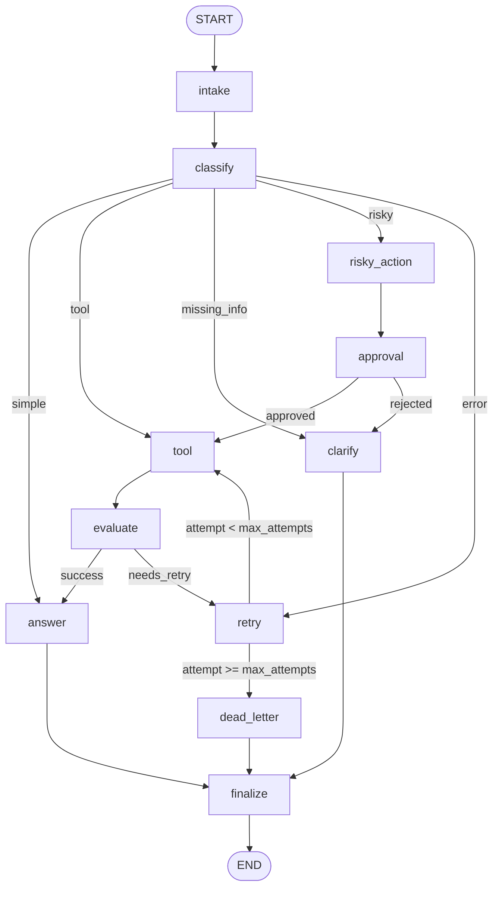

# Báo cáo thực hành Day 08 — LangGraph Support Ticket Agent

## 1. Thông tin sinh viên

- **Họ và tên**: Nguyễn Ngọc Dương
- **Mã số sinh viên (Student ID)**: 2A202601717
- **Ngày hoàn thành**: 2026-08-25

## 2. Kiến trúc hệ thống (Architecture)

Quy trình làm việc được thiết kế dưới dạng một đồ thị trạng thái `StateGraph` hoàn chỉnh bao gồm
**11 nodes** và **4 conditional edges** điều hướng luồng:

### Chức năng chi tiết của các Node:
- **`intake`**: Chuẩn hóa nội dung query đầu vào của ticket người dùng.
- **`classify`**: Phân loại ý định qua LLM với Structured Output (`IntentClassification`)
  vào 5 nhóm: `simple`, `tool`, `missing_info`, `risky`, `error`.
- **`tool`**: Giả lập gọi API backend; mô phỏng lỗi tạm thời ở lần 0–1 của tuyến error.
- **`evaluate`**: Cổng kiểm tra kết quả tool: kết hợp kiểm tra lỗi và **LLM-as-judge**
  để quyết định kết quả đạt (`"success"`) hay cần thử lại (`"needs_retry"`).
- **`retry`**: Ghi nhận lần thử lại và tăng biến đếm `attempt`.
- **`route_after_retry`**: Chặn số lần retry tối đa (`attempt < max_attempts` ➔ `tool`,
  ngược lại ➔ `dead_letter`).
- **`risky_action` ➔ `approval`**: Tác vụ tài chính/xóa dữ liệu buộc qua duyệt Human-In-The-Loop.
  Mặc định tự động duyệt trong CI; khi bật `LANGGRAPH_INTERRUPT=true` node sẽ gọi `interrupt()`.
- **`clarify`**: Sinh câu hỏi làm rõ cho yêu cầu thiếu thông tin (`missing_info`)
  hoặc khi tác vụ rủi ro bị từ chối duyệt.
- **`answer`**: Sử dụng LLM sinh câu trả lời tự nhiên, có căn cứ từ context.
- **`dead_letter`**: Xử lý yêu cầu vượt quá số lần retry tối đa, chuyển tiếp cho chuyên viên.
- **`finalize`**: Ghi nhận LabEvent kiểm toán cuối cùng trước khi kết thúc (`END`).

## 3. Schema trạng thái (State Schema & Reducers)

| Trường dữ liệu | Cơ chế Reducer | Mục đích sử dụng |
|---|---|---|
| `messages` | Nối tiếp (`Annotated[list, add]`) | Nhật ký tin nhắn hội thoại kiểm toán |
| `tool_results` | Nối tiếp (`Annotated[list, add]`) | Lưu vết lịch sử các lần gọi tool |
| `errors` | Nối tiếp (`Annotated[list, add]`) | Ghi nhận chi tiết các lỗi phát sinh |
| `events` | Nối tiếp (`Annotated[list, add]`) | Toàn bộ chuỗi sự kiện kiểm toán (`LabEvent`) |
| `route` | Ghi đè (Overwrite) | Nhánh định tuyến hiện tại của ticket |
| `risk_level` | Ghi đè (Overwrite) | Mức độ rủi ro (`"low"` hoặc `"high"`) |
| `attempt` | Ghi đè (Overwrite) | Biến đếm số lần retry hiện tại |
| `max_attempts` | Ghi đè (Overwrite) | Giới hạn retry tối đa của kịch bản |
| `evaluation_result` | Ghi đè (Overwrite) | Kết quả thẩm định tool (`"success"`/`"needs_retry"`) |
| `pending_question` | Ghi đè (Overwrite) | Câu hỏi làm rõ cho nhánh `missing_info` |
| `proposed_action` | Ghi đè (Overwrite) | Mô tả hành động rủi ro cần phê duyệt |
| `approval` | Ghi đè (Overwrite) | Quyết định phê duyệt từ con người (dict) |
| `final_answer` | Ghi đè (Overwrite) | Phản hồi cuối cùng do LLM sinh ra |

Toàn bộ các trường dữ liệu đều tuần tự hóa được (serializable), giúp lưu trữ an toàn trong
Checkpointer mà không làm phình to kích thước trạng thái.

## 4. Kết quả thực thi kịch bản (Scenario Results)

### Bảng tổng kết chung:

| Chỉ số | Giá trị |
|---|---:|
| Tổng số kịch bản (Total scenarios) | 7 |
| Tỷ lệ thành công (Success rate) | 100% |
| Số node trung bình đi qua (Avg nodes visited) | 6.4 |
| Tổng số lần retry (Total retries) | 3 |
| Tổng số lần interrupt HITL (Total interrupts) | 2 |
| Phục hồi trạng thái thành công (Resume success) | True |

### Bảng chi tiết từng kịch bản:

| Kịch bản | Kỳ vọng | Thực tế | Đạt? | Retries | Interrupts | Duyệt HITL |
|---|---|---|:---:|---:|---:|:---:|
| S01_simple | simple | simple | Đạt | 0 | 0 | - |
| S02_tool | tool | tool | Đạt | 0 | 0 | - |
| S03_missing | missing_info | missing_info | Đạt | 0 | 0 | - |
| S04_risky | risky | risky | Đạt | 0 | 1 | Bắt buộc |
| S05_error | error | error | Đạt | 2 | 0 | - |
| S06_delete | risky | risky | Đạt | 0 | 1 | Bắt buộc |
| S07_dead_letter | error | error | Đạt | 1 | 0 | - |

## 5. Phân tích lỗi & tình huống bất thường (Failure Analysis)

1. **Lỗi công cụ tạm thời & Vòng lặp thử lại có giới hạn (Transient Tool Failure & Retry Loop)**:
   - *Tình huống*: Tuyến `error` giả lập sự cố gián đoạn dịch vụ downstream (`ERROR` ở lần 0–1).
   - *Cơ chế xử lý*: Node `evaluate` phát hiện cờ lỗi và chuyển tiếp sang node `retry`. Vòng lặp
     được chặn cứng bởi điều kiện `attempt < max_attempts`. Khi vượt quá số lần cho phép (như S07
     với `max_attempts=1`), luồng tự động rẽ sang `dead_letter` để báo cho chuyên viên hỗ trợ,
     ngăn chặn triệt để nguy cơ vòng lặp vô hạn.

2. **Hành động rủi ro không có sự phê duyệt (Risky Action Without Approval)**:
   - *Tình huống*: Các yêu cầu nhạy cảm (hoàn tiền, xóa tài khoản) có thể gây thiệt hại lớn.
   - *Cơ chế xử lý*: Đồ thị bắt buộc đi qua `risky_action ➔ approval`. Chỉ khi có quyết định
     `approved == True` mới điều hướng tới `tool` thực thi; nếu `approved == False` sẽ rẽ sang
     nhánh `clarify` để hỏi lại khách hàng. Sự kiện được kiểm toán đầy đủ với `approval_observed`.

3. **Phân loại sai do mô hình LLM (LLM Misclassification & Ambiguity)**:
   - *Tình huống*: Query của người dùng mơ hồ hoặc chứa nhiều ý định mâu thuẫn.
   - *Cơ chế xử lý*: Thiết lập thứ tự ưu tiên nghiêm ngặt trong prompt (`risky` > `tool` >
     `missing_info` > `error` > `simple`), kết hợp fallback `missing_info` để hỏi làm rõ thay
     vì để LLM ảo giác (hallucination).

## 6. Minh chứng lưu trữ & phục hồi trạng thái (Persistence & Recovery)

Đồ thị được biên dịch cùng Checkpointer và mỗi lần thực thi đều gắn với một `thread_id` độc lập:
- **`MemorySaver`** (Mặc định): Lưu trữ state trong RAM, hỗ trợ xem lại lịch sử các bước
  thông qua `graph.get_state_history()`.
- **`SqliteSaver`** (Tính năng mở rộng): Lưu trạng thái bền vững vào file `checkpoints.db` với
  chế độ WAL mode (`PRAGMA journal_mode=WAL;`). Trạng thái vẫn nguyên vẹn sau khi tiến trình
  Python bị tắt và khởi động lại.

## 7. Các tính năng mở rộng đã hoàn thiện (Extension Work)

### Extension 1: Real Human-In-The-Loop Interrupt & Resume (`interrupt()`)
- **Baseline**: Mặc định chạy mock approval tự động duyệt để pass CI offline.
- **Thay đổi**: Khi bật `LANGGRAPH_INTERRUPT=true`, `approval_node` gọi `interrupt()` tạm dừng
  luồng tại node approval. Tiến trình được tiếp tục khi nhận quyết định qua
  `Command(resume={"approved": True/False, ...})`.
- **Cách kiểm tra**: Bộ unit test `test_hitl_interrupt_and_resume_approved` và
  `test_hitl_interrupt_and_resume_rejected` trong `tests/test_extensions.py`.
- **Bằng chứng**: Xác nhận `current_state.next == ("approval",)` khi tạm dừng và hoàn thành luồng
  đến `tool` hoặc `clarify` sau khi resume.
- **Giới hạn**: Cần có Checkpointer lưu trữ và caller tương tác bên ngoài để truyền quyết định.

### Extension 2: SQLite Durable Persistence & Crash Recovery
- **Baseline**: `MemorySaver` mất toàn bộ dữ liệu khi tắt ứng dụng.
- **Thay đổi**: `build_checkpointer("sqlite")` khởi tạo `SqliteSaver` lưu file database trên đĩa.
- **Cách kiểm tra**: Unit test `test_sqlite_persistence_across_instances` thực thi đồ thị trên
  Instance 1, giải phóng instance/kết nối, sau đó mở Instance 2 từ cùng file DB để khôi phục state.
- **Bằng chứng**: Trạng thái và chuỗi checkpoint được bảo toàn nguyên vẹn tại file
  `outputs/checkpoints.db`.
- **Giới hạn**: File SQLite cục bộ phù hợp máy đơn lẻ; với môi trường phân tán cần PostgreSQL.

### Extension 3: Time Travel & State History Inspection
- **Baseline**: Gọi graph invoke thông thường chỉ trả về state ở node cuối cùng.
- **Thay đổi**: Sử dụng `graph.get_state_history({"configurable": {"thread_id": ...}})`
  truy xuất toàn bộ lịch sử snapshot qua từng bước chuyển node.
- **Cách kiểm tra**: Unit test `test_time_travel_state_history` xác thực danh sách checkpoint.
- **Bằng chứng**: Có thể kiểm toán, phát lại (replay) hoặc rẽ nhánh (fork) từ state quá khứ.
- **Giới hạn**: Ghi đè checkpoint cũ sẽ thay đổi lịch sử kế tiếp nếu không tạo thread ID mới.

### Extension 4: Mermaid Graph Diagram Export
- **Baseline**: Cấu trúc đồ thị chỉ tồn tại dưới dạng mã nguồn Python.
- **Thay đổi**: Xuất đồ thị thực tế bằng `graph.get_graph().draw_mermaid()`.
- **Cách kiểm tra**: Unit test `test_mermaid_export` xác nhận sự hiện diện của đủ 11 nodes.
- **Bằng chứng**: File sơ đồ được lưu tại `outputs/graph_diagram.mmd`.
- **Giới hạn**: Thể hiện cấu trúc topology tĩnh, không phải đường đi động của từng input.

### Extension 5: LLM-as-Judge Evaluator với Fallback An Toàn
- **Baseline**: Thẩm định kết quả tool chỉ dựa vào chuỗi cố định (`"ERROR"` in text).
- **Thay đổi**: `evaluate_node` tích hợp mô hình `ToolQualityJudge` để chấm điểm ngữ nghĩa,
  bọc bởi bộ kiểm tra deterministic và cơ chế fallback try/except an toàn.
- **Cách kiểm tra**: Unit test `test_llm_judge_evaluator_fallback`.
- **Bằng chứng**: Đồ thị điều phối chính xác vòng lặp retry mà không làm ảnh hưởng test baseline.
- **Giới hạn**: Tốn thêm thời gian gọi LLM; cờ lỗi chuỗi vẫn là tuyến ưu tiên tốc độ cao.

### Extension 6: Giao diện trực quan tương tác Streamlit UI & Live Mermaid Simulation
- **Baseline**: Chạy kịch bản chế độ dòng lệnh (CLI/Headless) không có giao diện trực quan.
- **Thay đổi**: Xây dựng ứng dụng `streamlit_app.py` cho phép chọn kịch bản/nhập query, xem
  hành động rủi ro, bấm nút duyệt/từ chối HITL tương tác, và tự động highlight đường đi thực tế
  trên sơ đồ Mermaid mà không để lộ secret API key.
- **Cách kiểm tra**: Chạy lệnh `streamlit run streamlit_app.py` hoặc `make ui`.
- **Bằng chứng**: File `streamlit_app.py` hoạt động hoàn chỉnh với giao diện Dark mode trực quan.
- **Giới hạn**: Cần trình duyệt web cục bộ để tương tác.

## 8. Kế hoạch cải tiến sản phẩm (Improvement Plan)

- **Tích hợp API thực tế**: Chuyển đổi các mock tool thành API thật (cổng thanh toán, ERP)
  kèm Idempotency Key để đảm bảo giao dịch an toàn khi retry.
- **Checkpointer phân tán**: Nâng cấp lên PostgreSQL/Redis Checkpointer hỗ trợ Connection Pooling
  cho môi trường chịu tải cao đa cụm (clustered multi-agent).
- **Giám sát & Cảnh báo (Observability)**: Tích hợp OpenTelemetry / LangSmith để theo dõi độ trễ
  từng node và kích hoạt cảnh báo tức thì khi ticket rơi vào `dead_letter`.
- **Quản lý SLA Budget**: Bổ sung cơ chế timeout và ngân sách token theo từng node để đảm bảo
  thời gian phản hồi cho hàng đợi ticket khách hàng.
